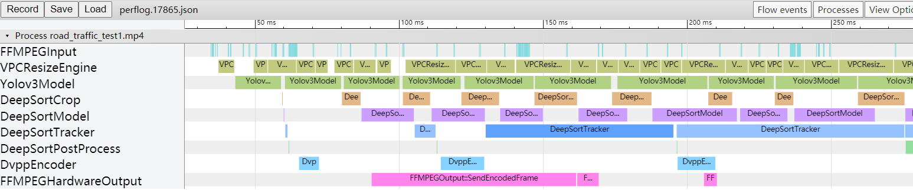

# 性能分析
为了方便分析应用的性能, demo中自带了一套性能分析的框架。在配置文件中打开"app_perf"开关即可输出性能日志。

性能日志文件:```perflog.<pid>.json```
## 查看方式
在chrome浏览器地址栏中输入这个地址打开tracing工具:[chrome://tracing](chrome://tracing)

点击load按钮加载json文件即可查看应用性能

## 注意事项
* 程序需要正常结束后才可以查看性能文件
* 输出文件较大，如果没有需要请关闭此功能